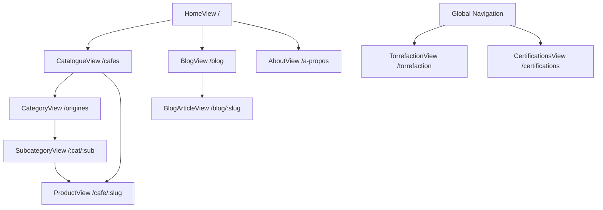
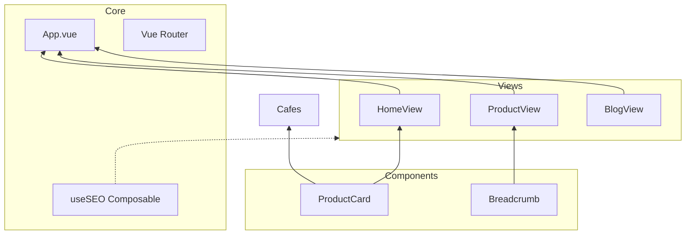

# Project Documentation

Grains & Origines is a specialized e-commerce platform for high-end coffee beans, built as a SEO-focused demonstration project. It features a robust architecture optimized for search engines, including dynamic metadata management, structured data (JSON-LD), and a clean, semantic URL structure.

## Architecture & Flows

### Navigation Structure
The following diagram illustrates the application's routing and page hierarchy.



### Component Hierarchy
The application follows a modular Vue 3 structure centered around a main layout in `App.vue`.



## Installation

### Prerequisites
- **Node.js**: Version 18.0 or higher
- **npm**: Version 9.0 or higher

### Setup
1. Clone the repository to your local machine.
2. Install dependencies:
   ```bash
   npm install
   ```

### Development Scripts
- **Start development server**:
  ```bash
  npm run dev
  ```
- **Build for production**:
  ```bash
  npm run build
  ```
- **Preview production build**:
  ```bash
  npm run preview
  ```

## Module Explanations

### `src/components/`
Contains reusable UI components designed for consistency and SEO (semantic HTML).
- **`ProductCard.vue`**: Displays coffee details in grids with proper `h3` hierarchy and optimized image tags.
- **`Breadcrumb.vue`**: Provides secondary navigation and generates BreadcrumbList structured data for SERPs.

### `src/views/`
Core page components mapped to specific routes.
- **`HomeView.vue`**: The landing page focusing on brand identity and featured products.
- **`ProductView.vue`**: Detailed product specification pages with deep-link capabilities.
- **`CategoryView.vue` & `SubcategoryView.vue`**: Dynamic listing pages filtered by origin, roast level, or certifications.
- **`BlogView.vue` & `BlogArticleView.vue`**: Content-marketing modules to drive organic traffic through long-form articles.

### `src/composables/useSEO.js`
The heart of the project's SEO strategy. This utility provides:
- **Dynamic Meta Tags**: Updates `document.title` and `<meta name="description">` on every route change.
- **Open Graph & Twitter Cards**: Ensures rich social sharing previews.
- **JSON-LD Generation**: Automatically injects `Product`, `BreadcrumbList`, and `Organization` schemas into the document head to enhance search result snippets.

### `src/router/`
Configures Vue Router with a focus on human-readable, keyword-rich URLs.
- Uses `createWebHistory` for clean URLs (no hashes).
- Implements lazy-loading for all views to improve initial PageSpeed scores.
- Defines specific patterns for categories and subcategories to maintain a strict URL hierarchy.

### `src/data/`
Acts as a local "headless" data source.
- **`products.js`**: Central repository for coffee varieties, pricing, and technical specs.
- **`blog.js`**: Contains structured article content, authors, and publication dates.
